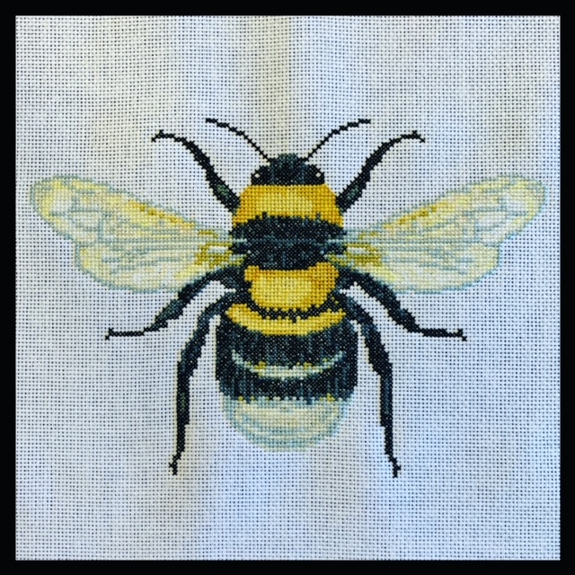

# Shelby's reading-notes

## Code 301 Reading Notes Table of Contents
  - [**Class 1** - Introduction to React and Components](class01.md)

## Code 201 Reading Notes Table of Contents
  - [**Read 1** - Introductory HTML and JavaScript](class-01.md)
  - [**Read 2** - HTML Text, CSS Introduction, and Basic JavaScript Instructions](class-02.md)
  - [**Read 3** - HTML Lists, CSS Boxes, JS Control Flow](class-03.md)
  - [**Read 4** - HTML Links, CSS Layout, JS Functions](class-04.md)
  - [**Read 5** - HTML Images; CSS Color & Text](class-05.md)
  - [**Read 6** - JS Object Literals; The DOM](class-06.md)
  - [**Read 7** - HTML Tables; JS Constructor Functions](class-07.md)
  - [**Read 8** - More CSS Layout](class-08.md)
  - [**Read 9** - Forms and Events](class-09.md)
  - [**Read 10** - JS Debugging](class-10.md)
  - [**Read 11** - Assorted Topics](class-11.md)
  - [**Read 12** - Docs for the HTML <canvas> Element & Chart.js](class-12.md)
  - [**Read 13** - Local Storage](class-13.md)
  - [**Read 14a** - CSS Transforms, Transitions, and Animations](class-14a.md)
  - [**Read 14b** - What Google Learned About Teams](class-14b.md)

## Code 102 Reading Notes Table of Contents
  - [Session 1 Reading Notes - Learning Markdown](Read1-Learning-Markdown.md)
  - [Session 2 Reading Notes - The Coder's Computer](Read2-The-Coders-Computer.md)
  - [Session 3 Reading Notes - Revisions and the Cloud](Read3-Revisions-and-the-Cloud.md)
  - [Session 4 Reading Notes - Read4-Process-of-a-New-Website](Read4-Process-of-a-New-Website.md)
  - [Session 5 Reading Notes - Read5-Design-web-pages-with-CSS](Read5-Design-web-pages-with-CSS.md)
  - [Session 6a Reading Notes - Read6a-Dynamic-web-pages-with-JS](Read6a-Dynamic-web-pages-with-JS.md)
  - [Session 6b Reading Notes - Read6b-Computer-Architecture-and-Logic](Read6b-Computer-Architecture-and-Logic.md)
  - [Session 7 Reading Notes - Read7 Programming with JavaScript](Read7-Programming-with-JS.md)
  - [Session 8 Reading Notes - Read8 Operators and Loops](Read8-Operators-and-Loops.md)

## Extra Fun Things
  - [Shelby's Super Sweet Profile](https://github.com/shelbyharner)
  - [Hello it's Shelby - Bio](https://shelbyharner.github.io/Hello-its-Shelby/)

 
